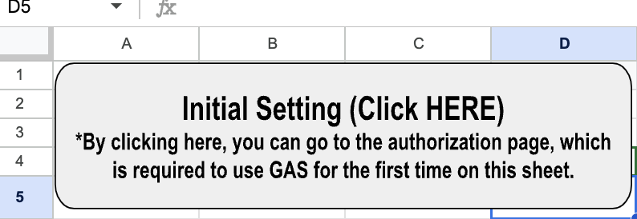
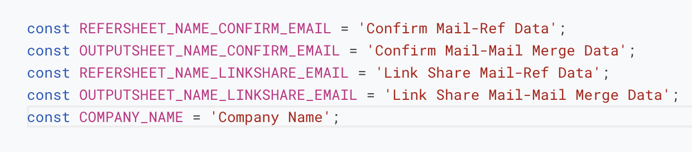
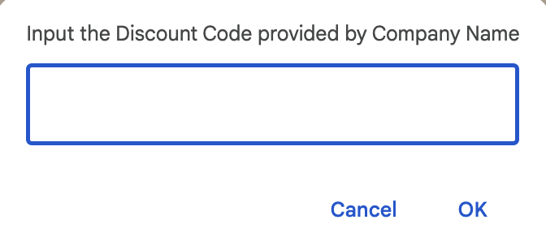
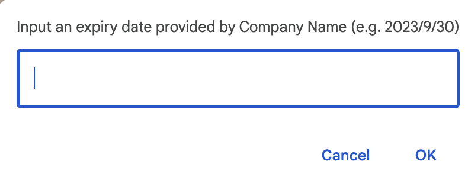
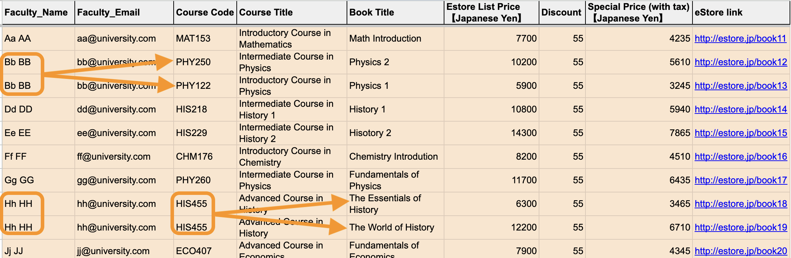
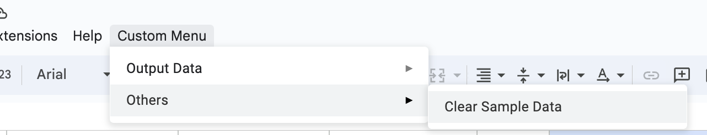

- [Prerequisites](#prerequisites)
- [Setup](#setup)
- [Others](#others)

[日本語版はこちら](./README_JP.md)
# E-book Data Management and Mail Merge Automation

This project involves a Google Apps Script that automates the process of organizing e-book data in Google Sheets and utilizing [Group Merge Add-on](https://www.scriptable-assets.page/add-ons/group-merge/) to send personalized emails. The script is specifically designed to handle two types of emails: confirmation emails and link share emails.

- Confirmation Emails: The script processes data to generate unique items for each confirmation email, such as recipient names, course information, and book details. It then uses [Group Merge Add-on](https://www.scriptable-assets.page/add-ons/group-merge/) to send personalized confirmation emails to the recipients.

- Link Share Emails: The script also handles data for link share emails. It organizes the necessary information, including recipient names, course details, and shared links. Using [Group Merge Add-on](https://www.scriptable-assets.page/add-ons/group-merge/), it sends personalized link share emails to the recipients, providing them with the relevant links to access e-books or resources.

By automating these processes, the Google Apps Script streamlines the management and distribution of e-book data, making it easier to send personalized emails to recipients in bulk.

## Prerequisites

- A Google account with access to Google Sheets.
- Basic understanding of Google Sheets and Google Apps Script.
- Set up another Spreadsheet to use [Group Merge Add-on](https://www.scriptable-assets.page/add-ons/group-merge/).

## Setup

1. **Open Your Google Sheet**: Access [Sample Google Sheet](https://docs.google.com/spreadsheets/d/1mMuQSK06hIcAUcI1qW4cgD2_IKOXU9_DAR2CTj2a-a8/edit#gid=1834592607).
2. **Conduct GAS Authorization**: Access `Initial Setting` Sheet and click the initial setting button. This enables you to go to the authorization page for Google Apps Script.

  

3. **Customize Constant Variables for Built-in Functions**: Navigate to the Apps Script page and adjust the constant variables in `variables.gs` to suit your needs.

  

## Usage

1. **Input Reference Data**: Enter reference data in the designated orange range for each column in the reference sheets (`Confirm Mail-Ref Data`/ `Link Share Mail-Ref Data`).

  

2. **Process data**: Execute functions from custom menu in your Google Sheets UI.

  

  - Select `Output Mail Merge Data for Confirm Email` to process data for confirmation emails.

    This function is responsible for processing data to generate mail merge data specifically for confirmation emails. The logic of the function can be summarized as follows:

    1. Read each row of data from the input source.
    2. If the second faculty info is provided, combine the names and emails of the faculty members.
    3. If the first faculty has multiple records, combine the data to create a single entry for that faculty.
    4. If a faculty has two books for a certain course, list the book information as "BookXX" where XX represents the book number.
    5. Generate the final mail merge data that can be used to send confirmation emails.

    Below are example screenshots illustrating the input data and the output data:

  

  - Select `Output Mail Merge Data for Link Share Email` to process data for link share emails.

    This function handles the processing of data to generate mail merge data specifically for link share emails.
    Once the button is clicked, you will be prompted to enter the discount code and expiration date.
    The logic of the function can be summarized as follows:

    1. Read each row of data from the input source. (Unlike the confirmation email, this function does not accept the second faculty info.)
    2. If the faculty has multiple records, combine the data to create a single entry for that faculty.
    3. If a faculty has two books for a certain course, combine the book information by "/" (e.g. Book A / Book B).
    4. Generate the final mail merge data that can be used to send confirmation emails.

    Below are example screenshots:

  

  

  

  

3. **Use Output Data for Mail Merge**: Processed data are output in output sheets (`Confirm Mail-Mail Merge Data`/ `Link Share Mail-Mail Merge Data`). Use the data for Mail Merge. As for the usage of Mail Merge, click [HERE](https://www.scriptable-assets.page/add-ons/group-merge/).

## Others

- **Clear Sample Data**: Clear sample data by clicking `Clear Sample Data` here.

  

- **Customization**: You can customize the scripts according to your specific preferences.
